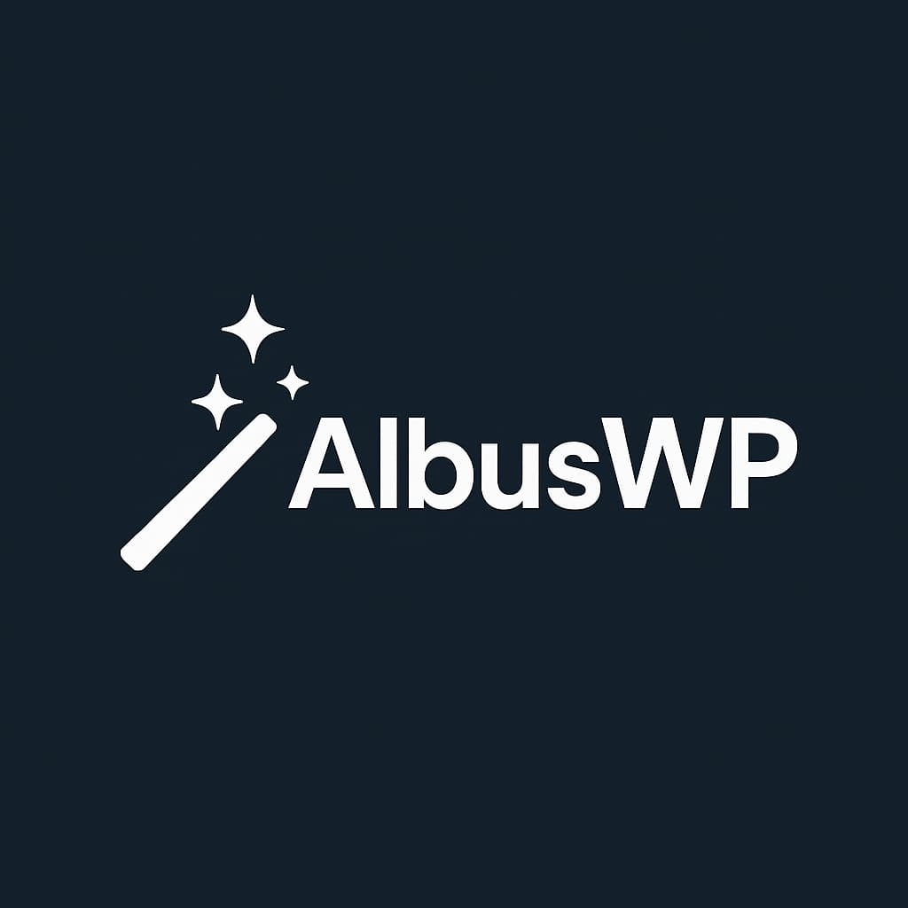

# AlbusWP Bridge

**The Ultimate WordPress Page Builder Conversion Tool**

AlbusWP Bridge converts legacy page builder content into modern formats with support for 7 page builders and 12+ conversion paths. Migrate from WPBakery, Elementor, Divi, Classic Editor, Kirki, Gutenberg, and Bricks to either Gutenberg blocks or Bricks Builder.

> **Beta Release**  
> This plugin is feature-complete but requires real-world testing before production deployment. Test thoroughly on staging environments.

## Why AlbusWP?

- ✅ **7 Page Builders Supported** - More than any competitor
- ✅ **FREE Tier with Real Value** - Test conversions before committing
- ✅ **Transparent Process** - JSON export shows exactly what's extracted
- ✅ **Automatic Backups** - One-click restore if needed
- ✅ **Bulk Operations** - Convert multiple pages at once (PRO)
- ✅ **Modern Architecture** - Built for reliability and performance

## Overview

AlbusWP provides a complete migration solution by:

- Detecting 7 different page builders across your site
- Extracting content to a neutral intermediate format
- Converting to either Gutenberg blocks or Bricks Builder elements
- Preserving structure, styling, and content relationships
- Creating automatic backups before every conversion
- Offering debug tools for transparency (JSON export)

## Conversion Matrix

### ✅ FREE Tier (10 Pages Limit)

| From            | To        | Status  |
| --------------- | --------- | ------- |
| WPBakery        | Gutenberg | ✅ Live |
| Divi            | Gutenberg | ✅ Live |
| Kirki           | Gutenberg | ✅ Live |
| Classic Editor  | Gutenberg | ✅ Live |
| Gutenberg       | Bricks    | ✅ Live |
| **JSON Export** | Debug     | ✅ Live |

### 🔒 PRO Tier (Unlimited)

| From           | To        | Status  |
| -------------- | --------- | ------- |
| WPBakery       | Bricks    | ✅ Live |
| Divi           | Bricks    | ✅ Live |
| Kirki          | Bricks    | ✅ Live |
| Elementor      | Gutenberg | ✅ Live |
| Elementor      | Bricks    | ✅ Live |
| Classic Editor | Bricks    | ✅ Live |
| Gutenberg      | Bricks    | ✅ Live |
| Bricks         | Gutenberg | ✅ Live |
| **Bulk**       | All       | ✅ Live |

### Tier Features

**FREE Features:**

- Scan up to 10 pages
- Convert up to 10 pages
- Manual per-page conversion
- All FREE tier conversion paths
- JSON export for debugging
- Automatic backups & restore

**PRO Features:**

- Unlimited scans & conversions
- All conversion paths unlocked
- Elementor support
- Bricks Builder output
- Bulk conversion (one-click)
- Full style mapping
- Multi-site activation (Agency/Studio tiers)
- Priority support (Studio tier)

## Architecture

The plugin uses a four-stage pipeline:

1. **Detect** - Scans posts/pages and identifies which builder is being used
2. **Extract** - Parses builder-specific formats into a neutral tree structure
3. **Convert** - Transforms neutral format to target builder format
4. **Import** - Writes converted content back to the database with automatic backup

### Builder Detection Priority

1. Bricks (`_bricks_page_content_2` or `_bricks_data` meta)
2. Elementor (`_elementor_data` meta)
3. WPBakery (`[vc_row` shortcode in content)
4. Divi (`[et_pb_section` shortcode in content)
5. Kirki (`_kirki_data` meta)
6. Gutenberg (`<!-- wp:` block markers in content)
7. Classic Editor (plain HTML fallback)

### Directory Structure

```
src/
├── Admin/
│   └── AdminPage.php           # Admin UI, REST API, orchestration
├── Detect/
│   └── Detector.php            # Content scanner (7 builders)
├── Extract/
│   ├── WPBakery.php            # WPBakery shortcode parser
│   ├── Elementor.php           # Elementor JSON parser
│   ├── Divi.php                # Divi shortcode parser (15+ modules)
│   ├── Kirki.php               # Kirki customizer extractor
│   ├── ClassicEditor.php       # HTML/TinyMCE parser
│   ├── Gutenberg.php           # Gutenberg block parser
│   └── Bricks.php              # Bricks reverse extractor
├── Convert/
│   ├── ToGutenberg.php         # Gutenberg block generator
│   └── ToBricks.php            # Bricks element generator
├── Import/
│   ├── GutenbergWriter.php     # Writes Gutenberg markup + backup
│   └── BricksWriter.php        # Writes Bricks JSON + backup
└── Util/
    ├── ShortcodeParser.php     # Shortcode tree parser
    └── Logger.php              # Debug logging system
```

## Installation

1. Upload the `AlbusWP` folder to `/wp-content/plugins/`
2. Activate the plugin through the 'Plugins' menu in WordPress
3. Navigate to **Albus** in the WordPress admin menu

## Usage

### Via Admin Interface

1. Go to **Albus** in the WordPress admin
2. Click **Scan Site** to detect all page builder content
3. Review detected pages (shows which builder is being used)
4. Click **Preview** to see what the conversion will look like (optional)
5. Choose your target format:
   - **To Gutenberg** - Convert to native WordPress blocks
   - **To Bricks** - Convert to Bricks Builder (requires Bricks plugin)
6. Click **Convert** to perform the conversion (automatic backup created)
7. Use the **Backups** tab to restore if needed

### Testing Divi Conversions

To test the Divi button conversion (or any Divi module):

1. **Create a test page with Divi Builder:**

   ```
   Go to Pages → Add New
   Click "Use Divi Builder"
   Add a Button module
   Configure: Button Text = "Click Me", URL = "https://example.com"
   Save the page
   ```

2. **Scan and convert via Admin UI:**

   ```
   Go to Albus → Scan Site
   Find your test page (should show "Source: divi")
   Click "To Gutenberg" or "To Bricks"
   ```

3. **Or use REST API:**

   ```bash
   # First, get the post ID
   curl "https://yoursite.local/wp-json/albus/v1/scan"

   # Then convert it
   curl -X POST "https://yoursite.local/wp-json/albus/v1/convert" \
     -H "Content-Type: application/json" \
     -d '{"post_id": 123, "target": "gutenberg"}'

   # Or preview first (non-destructive)
   curl -X POST "https://yoursite.local/wp-json/albus/v1/preview" \
     -H "Content-Type: application/json" \
     -d '{"post_id": 123, "target": "gutenberg"}'
   ```

4. **Debug with JSON export:**

   ```bash
   # See exactly what was extracted from Divi
   curl "https://yoursite.local/wp-json/albus/v1/export-json/123"
   ```

5. **Check the result:**
   ```
   Edit the converted page in Gutenberg/Bricks
   You should see your button converted properly
   Check albus-debug.log for detailed extraction logs
   ```

### Via REST API

**Scan for convertible content:**

```bash
GET /wp-json/albus/v1/scan
```

**Preview conversion (non-destructive):**

```bash
POST /wp-json/albus/v1/preview
{
  "post_id": 123,
  "target": "gutenberg"  // or "bricks"
}
```

**Convert a post:**

```bash
POST /wp-json/albus/v1/convert
{
  "post_id": 123,
  "target": "gutenberg"  // or "bricks"
}
```

**Export as JSON (debugging):**

```bash
GET /wp-json/albus/v1/export-json/123
```

**Bulk convert (PRO):**

```bash
POST /wp-json/albus/v1/bulk-convert
{
  "post_ids": [1, 2, 3],
  "target": "bricks"
}
```

**Restore from backup:**

```bash
POST /wp-json/albus/v1/restore
{
  "post_id": 123
}
```

## Supported Elements

### WPBakery

- ✅ Rows & Columns (`vc_row`, `vc_column`)
- ✅ Text blocks (`vc_text_block`)
- ✅ Images (`vc_single_image`)
- ✅ Buttons (`vc_btn`)
- ✅ Custom CSS & classes

### Elementor

- ✅ Sections & Columns (old system)
- ✅ Containers (new flexbox system)
- ✅ Headings (H1-H6)
- ✅ Text editor
- ✅ Images
- ✅ Buttons
- ✅ Icon boxes
- ✅ Call-to-actions (CTAs)
- ✅ Image carousels
- ✅ Dividers
- ✅ Star ratings
- ✅ Testimonial carousels
- ✅ Forms (placeholder)
- ✅ Social icons
- ✅ Sliders

### Divi

- ✅ Sections, Rows & Columns
- ✅ Text modules
- ✅ Images
- ✅ Buttons
- ✅ Headings
- ✅ Blurbs (icon + title + content)
- ✅ Call-to-actions
- ✅ Videos
- ✅ Sliders
- ✅ Testimonials
- ✅ Galleries
- ✅ Contact forms (placeholder)
- ✅ Dividers
- ✅ Code modules
- ✅ Background colors & images

### Gutenberg

- ✅ Paragraphs
- ✅ Headings (H1-H6)
- ✅ Images
- ✅ Buttons
- ✅ Lists (ordered & unordered)
- ✅ Quotes & Pullquotes
- ✅ Code & Preformatted
- ✅ HTML blocks
- ✅ Separators
- ✅ Spacers
- ✅ Groups & Covers
- ✅ Columns
- ✅ Galleries
- ✅ Video & Audio
- ✅ Embeds
- ✅ Files
- ✅ Tables
- ✅ Media & Text
- ✅ Social links

### Bricks (Reverse Conversion)

- ✅ Sections & Containers
- ✅ Headings
- ✅ Text & Rich Text
- ✅ Images
- ✅ Buttons
- ✅ Videos
- ✅ Icons
- ✅ Dividers
- ✅ Lists
- ✅ Code blocks
- ✅ Maps (placeholder)
- ✅ Forms (placeholder)
- ✅ Sliders & Carousels
- ✅ Testimonials

### Classic Editor

- ✅ Headings (H1-H6)
- ✅ Paragraphs
- ✅ Images (with WP classes)
- ✅ Lists (ordered & unordered)
- ✅ Blockquotes
- ✅ Tables
- ✅ Code & Pre blocks
- ✅ WordPress galleries
- ✅ Custom HTML

### Kirki

- ✅ Theme mods
- ✅ Post meta
- ✅ Repeater fields
- ✅ Text content
- ✅ Images
- ✅ Complex data structures

## Target Formats

### Gutenberg

Converts to native WordPress block markup with proper block comments and HTML structure.

### Bricks Builder

Generates Bricks-compatible JSON structure stored in post meta (`_bricks_page_content_2`).

## Known Limitations

- Complex nested layouts may require manual review
- Custom CSS from page builders needs manual migration
- Third-party widgets/addons not supported (falls back to HTML)
- Some styling attributes may be lost in conversion
- FREE tier: 10 pages scan/convert limit
- Forms converted to placeholders (preserve original form shortcodes separately)
- Animations and interactions not preserved
- Dynamic/conditional content needs manual review

## Development

### Requirements

- PHP 7.4+
- WordPress 5.0+ (for Gutenberg support)
- Bricks Builder 1.5+ (for Bricks conversion)
- Composer (for Freemius SDK)

### Code Standards

- PSR-4 autoloading under `Albus\` namespace
- WordPress coding standards
- Proper escaping and sanitization
- Type hints on all methods
- Comprehensive error handling
- Detailed logging via `Logger` class

### Debugging

All conversions are logged to `albus-debug.log` in the plugin directory:

```
[2025-01-15 10:30:45] INFO: Starting conversion [post_id: 123, target: gutenberg]
[2025-01-15 10:30:45] DEBUG: Detected source [post_id: 123, source: divi]
[2025-01-15 10:30:45] DEBUG: Extracting from divi [post_id: 123]
[2025-01-15 10:30:46] INFO: Divi: Extraction complete [output_count: 15]
[2025-01-15 10:30:46] INFO: Converting to Gutenberg [post_id: 123]
[2025-01-15 10:30:46] INFO: Gutenberg conversion complete [post_id: 123]
```

## REST API Reference

All endpoints require `manage_options` capability and use WordPress nonce verification.

### `GET /wp-json/albus/v1/scan`

Scans site for convertible content.

**Response:**

```json
{
  "count": 25,
  "items": [
    {
      "id": 123,
      "title": "About Page",
      "source": "divi",
      "edit": "https://site.com/wp-admin/post.php?post=123&action=edit",
      "requires_pro": false
    }
  ],
  "is_pro": false,
  "free_count": 15,
  "pro_count": 10,
  "scan_limit": 10,
  "conversions_used": 3,
  "conversions_remaining": 7
}
```

### `POST /wp-json/albus/v1/preview`

Preview conversion without modifying the post.

**Parameters:**

- `post_id` (int) - Post to preview
- `target` (string) - 'gutenberg' or 'bricks'

**Response:**

```json
{
  "ok": true,
  "post_id": 123,
  "source": "divi",
  "target": "gutenberg",
  "preview": "<!-- wp:heading -->...",
  "element_count": 15
}
```

### `POST /wp-json/albus/v1/convert`

Convert a post to target format (creates automatic backup).

**Parameters:**

- `post_id` (int) - Post to convert
- `target` (string) - 'gutenberg' or 'bricks'

**Response:**

```json
{
  "ok": true,
  "post_id": 123,
  "source": "divi",
  "target": "gutenberg",
  "message": "Post updated successfully. Content converted to Gutenberg blocks.",
  "edit_url": "https://site.com/wp-admin/post.php?post=123&action=edit",
  "details": "Converted 15 elements from divi",
  "conversions_used": 4,
  "conversions_remaining": 6
}
```

### `GET /wp-json/albus/v1/export-json/{post_id}`

Export extracted content as JSON for debugging (FREE tier).

**Response:**

```json
{
  "ok": true,
  "post_id": 123,
  "post_title": "About Page",
  "source": "divi",
  "element_count": 15,
  "neutral_tree": [
    {"type": "section", "style": {}, "children": [...]},
    {"type": "heading", "level": 2, "text": "Welcome"}
  ],
  "timestamp": "2025-01-15 10:30:45"
}
```

### `POST /wp-json/albus/v1/bulk-convert` (PRO)

Convert multiple posts at once.

**Parameters:**

- `post_ids` (array) - Array of post IDs to convert
- `target` (string) - 'gutenberg' or 'bricks'

**Response:**

```json
{
  "ok": true,
  "total": 10,
  "success": 9,
  "failed": 1,
  "results": [
    { "post_id": 1, "ok": true, "message": "Success" },
    { "post_id": 2, "ok": false, "message": "No content found" }
  ]
}
```

### `POST /wp-json/albus/v1/restore`

Restore a post from its backup.

**Parameters:**

- `post_id` (int) - Post to restore

**Response:**

```json
{
  "ok": true,
  "post_id": 123,
  "message": "Post restored successfully from backup."
}
```

### `GET /wp-json/albus/v1/backups`

List all available backups.

**Response:**

```json
{
  "ok": true,
  "count": 5,
  "items": [
    {
      "post_id": 123,
      "title": "About Page",
      "post_type": "page",
      "backups": ["gutenberg", "bricks"],
      "meta": {
        "date": "2025-01-15 10:30:45",
        "source": "divi"
      }
    }
  ]
}
```

### `GET /wp-json/albus/v1/debug-raw/{post_id}`

View raw builder data before extraction.

**Response:**

```json
{
  "ok": true,
  "post_id": 123,
  "source": "divi",
  "data_type": "string",
  "raw_data": "[et_pb_section]...",
  "json_error": "No error"
}
```

## Roadmap

### Phase 1 (Current) ✅

- 7 page builders
- 12+ conversion paths
- FREE/PRO tiers
- Backup/restore
- JSON export

### Phase 2 (Planned)

- Oxygen Builder support
- Beaver Builder support
- Brizy Builder support
- Advanced style mapping
- Animation preservation
- CLI enhancement

### Phase 3 (Future)

- Template library
- Custom mapping rules
- Dynamic content handling
- Multi-language support
- API webhooks

## Support

- **Debug Logs:** Check `albus-debug.log` in plugin directory
- **JSON Export:** Use `/wp-json/albus/v1/export-json/{post_id}` to see extracted content
- **Issues:** Report bugs with debug log excerpts

## Contributing

Pull requests are welcome. For major changes, please open an issue first to discuss what you would like to change.

### Testing Checklist

- [ ] Test all 7 builder conversions
- [ ] Verify FREE tier limits enforced
- [ ] Test bulk conversion (PRO)
- [ ] Verify backups created
- [ ] Test restore functionality
- [ ] Check JSON export accuracy
- [ ] Validate tier restrictions
- [ ] Test edge cases (empty posts, complex layouts)

## Author

Created by **Nought Digital (Jake Henshall)**  
[https://nought.digital](https://nought.digital)

## License

[GPLv3](https://www.gnu.org/licenses/gpl-3.0.html)

---

## Quick Start

1. **Install & Activate** the plugin
2. **Go to Albus** in WordPress admin
3. **Click "Scan Site"** to detect page builders
4. **Test with one page** - click "To Gutenberg" or "To Bricks"
5. **Review the result** - edit the converted page
6. **Check the logs** - view `albus-debug.log` for details
7. **Bulk convert** when ready (PRO tier)

### Example: Converting a Divi Page

```bash
# 1. Create a test Divi page with a button
# Go to Pages → Add New → Use Divi Builder
# Add Button module: "Click Me" → "https://example.com"

# 2. Scan for the page
curl "https://yoursite.local/wp-json/albus/v1/scan"

# 3. Preview the conversion
curl -X POST "https://yoursite.local/wp-json/albus/v1/preview" \
  -H "Content-Type: application/json" \
  -d '{"post_id": 123, "target": "gutenberg"}'

# 4. See the extracted JSON
curl "https://yoursite.local/wp-json/albus/v1/export-json/123"

# 5. Convert it
curl -X POST "https://yoursite.local/wp-json/albus/v1/convert" \
  -H "Content-Type: application/json" \
  -d '{"post_id": 123, "target": "gutenberg"}'

# 6. Check the result in WordPress admin
# Go to Pages → Edit the converted page
# You should see a Gutenberg button block!
```

## Need Help?

1. **Check the logs:** `albus-debug.log` shows detailed extraction info
2. **Use JSON export:** See exactly what was extracted before conversion
3. **Test on staging:** Always test conversions on a staging site first
4. **Backup your database:** Before bulk conversions, backup your database
5. **Restore if needed:** Use the Backups tab to restore any post

**Ready to migrate? Start with the FREE tier today!** 🚀
